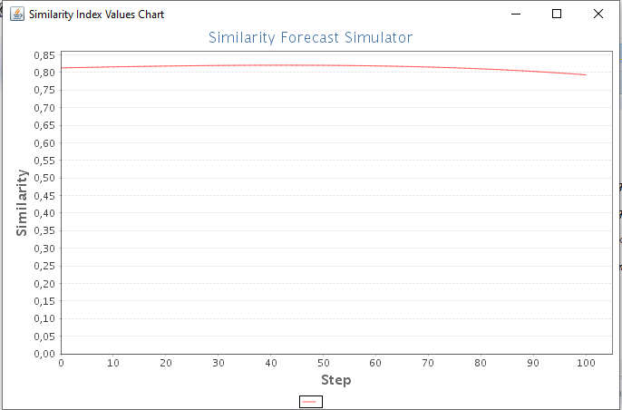

# Spectral Forecast application

TODO: to complete

## Getting Started

TODO: to complete

### Prerequisites

What things you need to install the software and how to install them

* JDK 1.8 [Java SE Development Kit 8](https://www.oracle.com/technetwork/java/javase/downloads/jdk8-downloads-2133151.html)

* Maven 3 [Apache Maven 3.6.0](https://maven.apache.org/download.cgi)

## Built With

* [Maven](https://maven.apache.org/) - Dependency Management

## Contributing

When contributing to this repository, please first discuss the change you wish to make via issue, email, or any other method with the owners of this repository before making a change.
1. Ensure any install or build dependencies are removed before the end of the layer when doing a build.
2. Update the README.md with details of changes to the interface, this includes new environment variables, exposed ports, useful file locations and container parameters.

## Author
* **Manel BIBI**